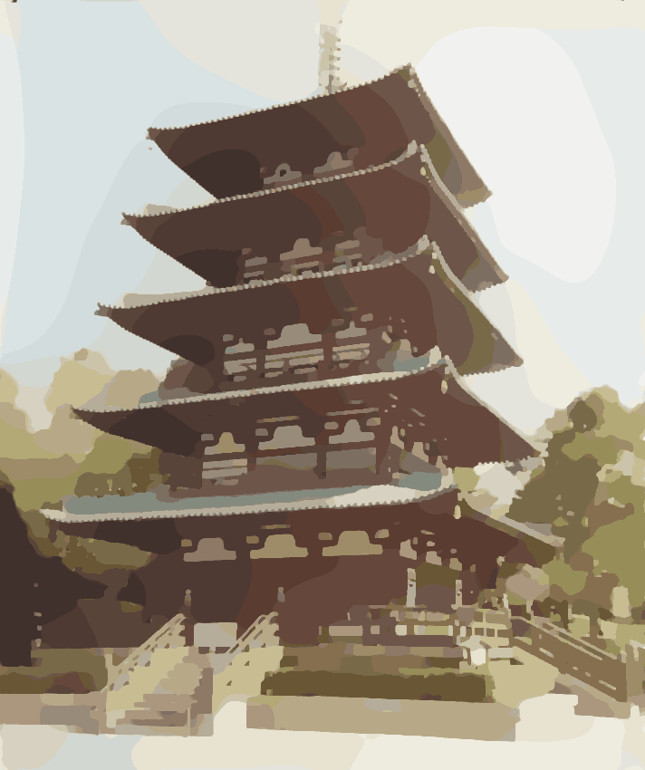
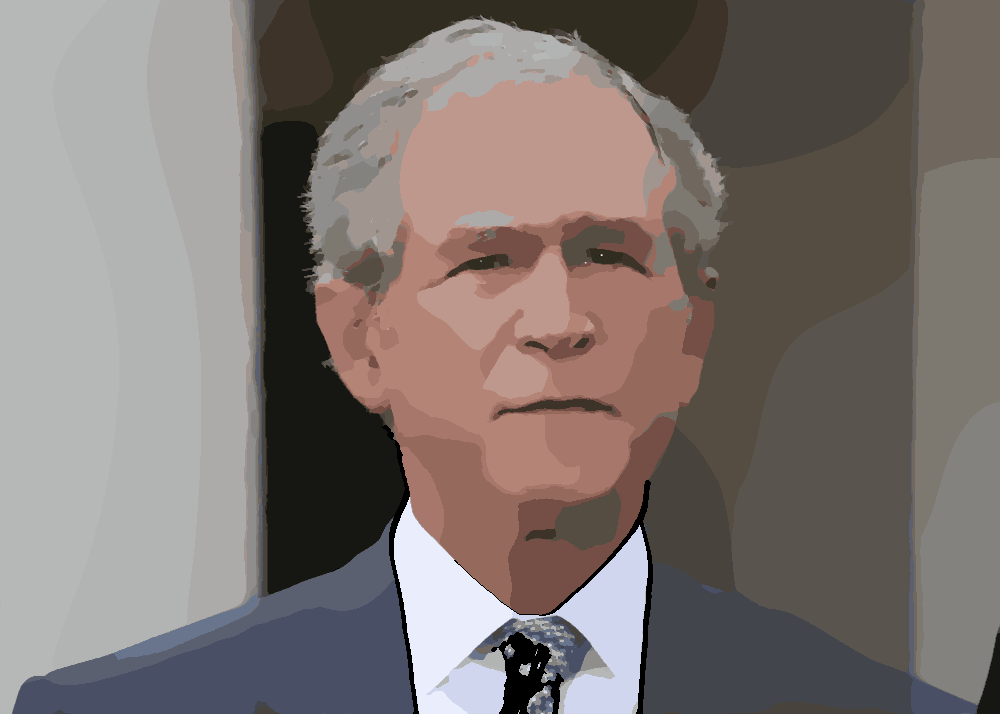
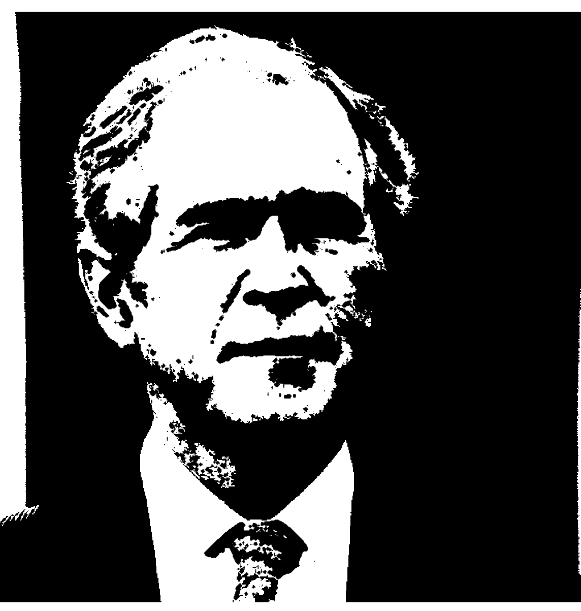

# Cartoon Transformation

###### Jake Garrison
###### EE 440 Final Project - 12/5/2015

## Features

The core of the program relies on a gradient minimization algorithm based the gradient minimization concept. This filter generally flattens the color content and removes high frequency noise while still retaining the edges and primary color change. In my experience, the gradient minimization algorithm I implemented preforms better than 'cartoon filters' and 'bilateral filters' found online which simply combing a blurring filter or bilateral filter with and edge detection. After the gradient minimization, the edges of the original image are extracted and altered using a customizable morphological transformation that serves to thicken the edges and display them in a more 'hand drawn stroke' form. After applying the modified edges to the gradient minimization output, the final output is formed after a simple color quantization is applied, reducing the color depth to better represent a cartoon.  These stroke and color settings, as well as the gradient minimization parameters are customizable through the GUI.

An additional mode inspired by old newspaper cartoons and the pop art style is also available in the GUI. This mode performs binary operations and color masking to output a simple, binary representation of the input that emphasizes the features present in the input image. As in the cartoon mode, this mode has morphological operations to better simulate human strokes, but the true elegance of this effect comes from its ability to accurately emphasize borders rather than all edges. The border is extracted with a function that scores all edges based off continuity and density to identify possible borders, then gaps in edges are filled in and the resulting fully closed edges are added to the output effectively emphasizing the borders.

## Implementation

The general implementation strategy is covered first, then the discussion is split into a section for both modes.

All code is developed in Matlab, and it has been tested on version 2015b. Some of the functionality relies on the Image Processing Toolbox. The _input_ image must be of the form \*.bmp, \*.tif \*.jpg, \*.png \*.hdf. The _output_ is saved as output.jpg.

The processing time is mainly dependent on the input image size. In general, the Color mode takes between 3 to 8 seconds due to the FFT and IFFT required and the gradient optimization process. In Binary mode, processing usually takes less than a second. While this code isn't optimized for speed, many considerations were accounted for in the implementation to help speed it up. For example, a simple Sobel edge detection is used rather than a slower more accurate Canny detection. Operations were vectorized as well to avoid loops as much as possible. Both modes rely on processing a binary representation of the input through the same Area Filter fed into the Morphological Transform block.

###### Area Filter

The area takes binary input and computes the pixel density of the black pixels. If the density for a cluster, or feature is below the value specified in the Detail parameter, that feature is erased. This effectively removes small details that frequently occur in nature, but are usually not included in a cartoon. In Matlab this is achieved with the bwareaopencommand.

###### Morphological Transform

The morphological transform block aims to add human artifacts to the output such as stroke simulation and variable edge thickness. The thickness is achieved by applying erosion with a disc structuring element that takes user input for radius. This effectively thickens all black pixels of the binary input. The stroke pattern and variable thickness is achieved by using dilation with a line structuring element to erase black pixels. Depending on the angle and length specified by the user, the patter can have a variable effect. Often it adds stroke patterns that may happen when an artist has their hand at a constant angle. It also produces interesting variable thickness, especially on rounded edges.

## _Color Mode_

###### Gradient Smoothing and Sharpening

The runtime can be controlled by lowering the maxbeta since the while loop executes until the max beta value is reach. A larger max beta, however is a more optimized result.

###### Sobel Edge

Simple Sobel edge detection is used to extract some of the defining edges to thicken and add strokes to. Other methods could be used, but Sobel is ideal for speed. The Matlab command used is edge(Img, 'Sobel').

###### Quantization

Color quantization is used to reduce the color palette to be closer to what an artist may have. This effectively eliminates color gradients and instead has more abrupt color shifts. The Matlab command used is rgb2ind(Img,colordepth,'nodither'). The dither option produces mixed results and often adds dot or fuzziness.

## _Binary Mode_

###### Binary

The first step here is to convert the input to binary. The binary threshold is specified with the graythresh(Img) command which uses Otsu's method.

###### Hue

A colored mask is created based off the _hue_ user input. This mask is multiplied by the binary image to fill in the white pixels with the color mask.

###### Boundary Emphasis

Using the command bwboundaries(Img), the exterior boundaries of objects is traced, as well as boundaries of holes inside these objects. Due to the Area Filter applied before, most holes inside boundaries are removed, but any remaining ones are removed in this process. Only the exterior boundaries are kept and added to the image. This approach offers much more control over which edges are included.
